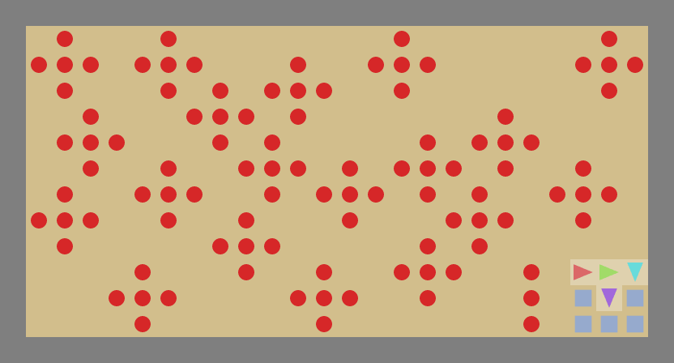

# Harvest Reputation experiments

This GitHub README contains additional materials regarding the reputation system experiments conducted in the Harvest Open environment.
For reading please view "Master Thesis: ...". The code used to run the experiments can be found in "Code". 
Below you can find visualizations of multiple key dynamics observations through GIFs. These GIFs are no results on their own, but are meant to give a clearer idea of the concepts and patterns described in the Thesis. Several key findings have been uncovered during the research by looking closely at these GIFs. This is a selection of experimental GIFs that have provided notable insights with a short description.
Hopefully this page will enhance your understanding of the research whilst further sparking your interest into the fascinating multi agent behaviors.

## Independent Baseline

Firstly, to properly understand how individually optimizing agents behave throughout the learning trajectory we have the following GIFs illustrating 3 key stages in the learning curve _naivety, tragedy_ and _maturity_.
These GIFs are sampled from the independent baseline seed 0 run at the following points in the reward curve to visualize the key stages of the tragedy.

plots of reward and peace

GIF peak 1

description

GIF tragedy
description

GIF recovery
description

...

GIF end
description

## Shared Baseline

The following GIF illustrates the behavior learned through optimizing a shared reward function.
This GIF is sampled from the shared baseline seed 0 run at the final checkpoint.

GIF
description
