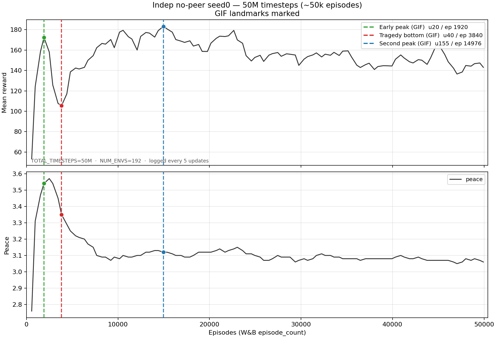
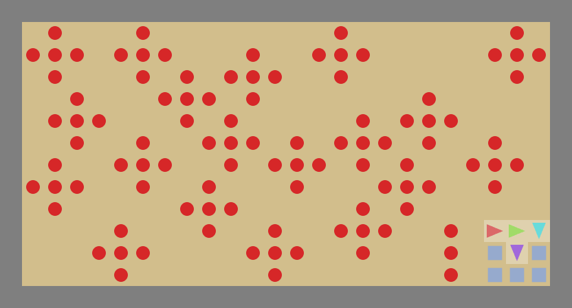
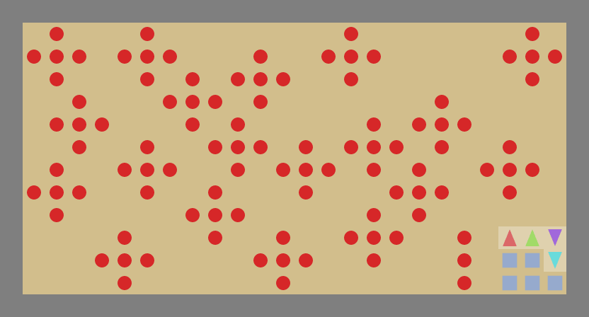
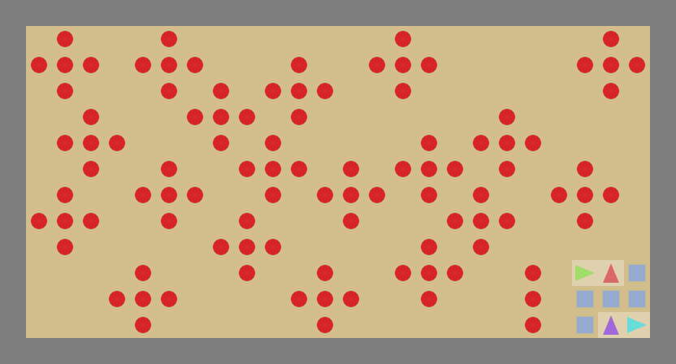
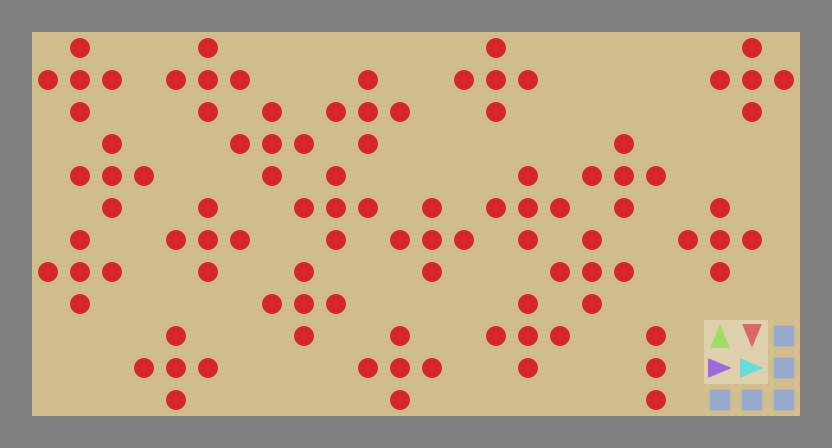
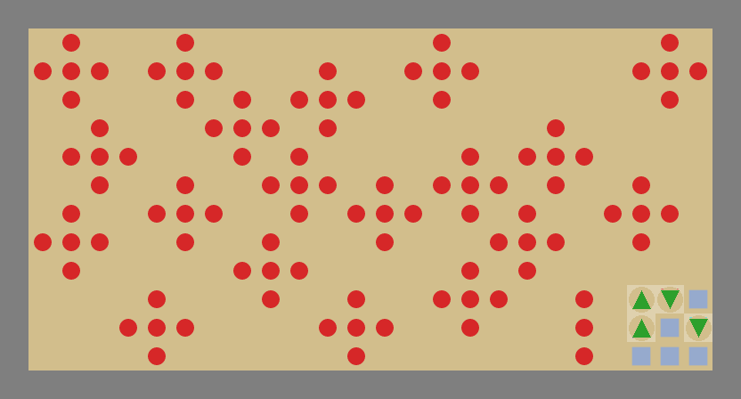
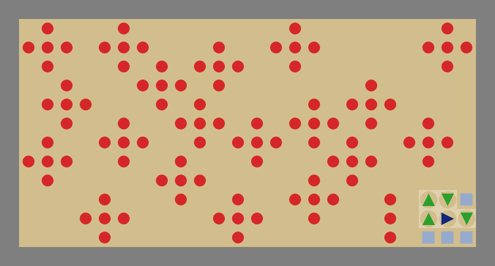

# Harvest Reputation experiments

This GitHub README contains additional materials regarding the reputation system experiments conducted in the Harvest Open environment.
For reading please view "Master Thesis: ...". The code used to run the experiments can be found in "Code". 
Below you can find visualizations of multiple key dynamics observations through GIFs. These GIFs are no results on their own, but are meant to give a clearer idea of the concepts and patterns described in the Thesis. Several key findings have been uncovered during the research by looking closely at these GIFs. This is a selection of experimental GIFs that have provided notable insights with a short description.
Hopefully this page will enhance your understanding of the research whilst further sparking your interest into the fascinating multi agent behaviors.

## Tier 1. Baselines

### Independent Baseline

Firstly, to properly understand how individually optimizing agents behave throughout the learning trajectory we have the following GIFs illustrating 3 key stages in the learning curve _naivety, tragedy_ and _maturity_.
These GIFs are sampled from the independent baseline seed 0 run at the following points in the reward curve to visualize the key stages of the tragedy.

**GIF peak 1**

Harvesting behavior during the first 250 frames of a 1000 frame episode at the first peak. 2 agents have learned to harvest quite well, 2 have not yet. The apples in the orchard remain plentiful. Zapping is not used.

**GIF tragedy**

Harvesting behavior during the first 250 frames of a 1000 frame episode at the lowest point of the tragedy. All agents have learned to harvest effectively. The apples in the orchard are fully depleted by the end of the 250 frames (after the first 1/4 of the full episode) and will not grow back from this point. The zapping action is not applied effectively.

**GIF recovery**

Harvesting behavior during the first 250 frames of a 1000 frame episode at the second peak (after the tragedy). All agents have learned to harvest and use their zapping beam often to time out their co-players. As a result, the apples in the orchard remain for longer.

**GIF end**

Harvesting behavior during the first 250 frames of a 1000 frame episode at the end of training (after 50k episodes). All agents have learned to harvest and use their zapping beam often to time out their co-players. As a result, the apples in the orchard remain for longer. Behavior is similar to the second peak. Agents seem to focus more on harvesting in between zapping.

### Shared Baseline

The following GIF illustrates the behavior learned through optimizing a shared reward function.
This GIF is sampled from the shared baseline seed 0 run at the final checkpoint.

**GIF end**

Harvesting behavior during the first 250 frames of a 1000 frame episode at the end of training (after 50k episodes). The agents have learned a split effort approach. 2 agents perform the bulk of apple collection, while 2 sit (partially) at the sideline. This way the average reward is high and the agents avoid overharvesting without the need to zap each other. The apples in the orchard remain plentiful. No zapping occurs.

## Tier 2. Enforcement
The following GIFs focus on the implementation of the reputation systems. Good agents are green, Bad agents are red. Police agents are Blue with light blue zap beams (different than the yellow zap beams of regular harvesters).

### Strict enforcement

**GIF end**

Harvesting behavior during the first 500 frames of a 1000 frame episode at the end of training (after 50k episodes) enforced strictly through a direct timeout for Bad agents. The agents follow the reputation system near perfectly. The enforcement system has to kick in only seldomly. This means agents do not zap each other and harvest efficiently at a rate that does not deplete the orchard. 

### Police enforcement

**GIF end**

Harvesting behavior during the first 500 frames of a 1000 frame episode at the end of training (after 50k episodes) enforced through a learning police agent. The agents follow the reputation system quite well. As an agent becomes Bad, the police agent tracks it down and zaps it effectively. The orchard is not close to depletion, but a local patch might get barren.

Notes on police behavior. The police agent has learned to keep to the lowest part of the Grid, over viewing a large part of the field. It has effectively learned to distinguish between Good and Bad agents. It only sporadically hits a Good agent, seemingly as accidental collateral damage when targeting a Bad agent.

Note on harvesting behavior. The majority of agents seem to harvest according to the norms, even an agent that becomes Bad does not splurge but mainly continues a r

## Tier 3. Self-supported

### Peer reward

**GIF end**

description

### Peer reward + Good immunity

**GIF end**

description

